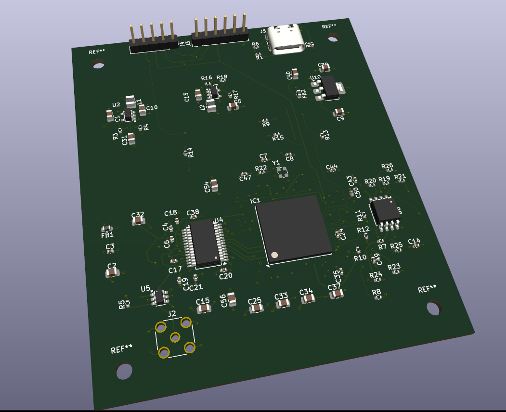
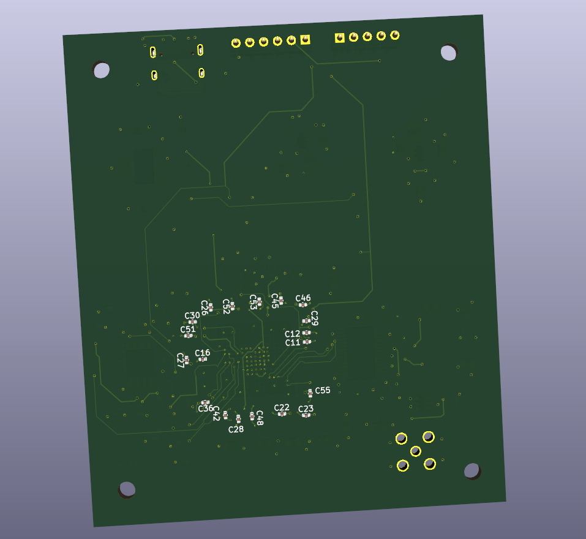

# ECP5 FPGA High Speed Data Acquisition System
A custom 4-layer mixed signal data acquisition PCB designed around a Lattice ECP5 FPGA and an analog devices AD9280 8 bit, 32 MSPS ADC.

The system combines analogue signal conditioning, multi rail power regulation, FPGA configuration circuitry and an 8-bit parallel ADC interface with a modular verilog acquisition pipeline for sample capture, FIFO buffering, acquisition control and streamed readout.

## Key Features:
- Lattice ECP5 LFE5U-12F-6BG256C FPGA
- Analog Devices AD9280 8 bit, 32 MSPS ADC
- Custom 4-layer mixed-signal PCB
- OPA836 analogue signal conditioning
- 1.1 V, 2.5 V and 3.3 V power rails
- 8-bit parallel ADC-to-FPGA interface
- FPGA configuration flash and JTAG programming interface
- Verilog ADC capture, FIFO buffering and acquisition control
- FSM-based buffered readout
- HDL simulation using Icarus Verilog and GTKWave
- FPGA synthesis using Yosys
- ECP5 place and route using nextpnr
- 32 MHz FPGA timing target successfully met
## Front PCB

## Back PCB

